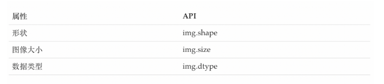

## 图像读取与显示
```python
import cv2 as cv
# 以灰度图的形式读取图像
img = cv.imread('../images/test.jpg',0)
cv.imshow('img',img)
cv.waitKey(0)
cv.destroyAllWindows()
```
读取方式的标志
cv.IMREAD*COLOR：以彩色模式加载图像，任何图像的透明度都将被忽略。这是默认参数。

cv.IMREAD*GRAYSCALE：以灰度模式加载图像

cv.IMREAD_UNCHANGED：包括alpha通道的加载图像模式。

**可以使用1、0或者-1来替代上面三个标志**

## 绘制几何图形
cv.line(): 绘制直线

cv.circle(): 绘制圆形

cv.rectangle(): 绘制矩形

cv.putText(): 在图像上添加文字
```python
import numpy as np
import cv2 as cv
import matplotlib.pyplot as plt
# 1 创建一个空白的图像
img = np.zeros((512,512,3), np.uint8)
# 2 绘制图形
cv.line(img,(0,0),(511,511),(255,0,0),5)
cv.rectangle(img,(384,0),(510,128),(0,255,0),3)
cv.circle(img,(447,63), 63, (0,0,255), -1)
font = cv.FONT_HERSHEY_SIMPLEX
cv.putText(img,'OpenCV',(10,500), font, 4,(255,255,255),2,cv.LINE_AA)
# 3 图像展示
plt.imshow(img[:,:,::-1])
plt.title('匹配结果'), plt.xticks([]), plt.yticks([])
plt.show()
```
## 图像的属性


## 其他操作
直接使用行列索引获取图像中的像素并进行修改

拆分通道：cv.split()

通道合并：cv.merge()

色彩空间的改变： cv.cvtColor(input_image，flag)

## 算数操作
### 加法
你可以使用OpenCV的cv.add()函数把两幅图像相加，或者可以简单地通过numpy操作添加两个图像，如res = img1 + img2。两个图像应该具有相同的大小和类型，或者第二个图像可以是标量值。

_**注意：OpenCV加法和Numpy加法之间存在差异。OpenCV的加法是饱和操作，而Numpy添加是模运算。**_

**_注意：这里都要求两幅图像是相同大小的。_**

参考以下代码：
```
>>> x = np.uint8([250])
>>> y = np.uint8([10])
>>> print( cv.add(x,y) ) # 250+10 = 260 => 255
[[255]]
>>> print( x+y )          # 250+10 = 260 % 256 = 4
[4]
```
### 混合
将两幅图像按照不同的比例进行混合
注意：这里都要求两幅图像是相同大小的。
```commandline
import numpy as np
import cv2 as cv
import matplotlib.pyplot as plt

# 1 读取图像
img1 = cv.imread("view.jpg")
img2 = cv.imread("rain.jpg")

# 2 图像混合
img3 = cv.addWeighted(img1,0.7,img2,0.3,0)

# 3 图像显示
plt.figure(figsize=(8,8))
plt.imshow(img3[:,:,::-1])
plt.show()
```